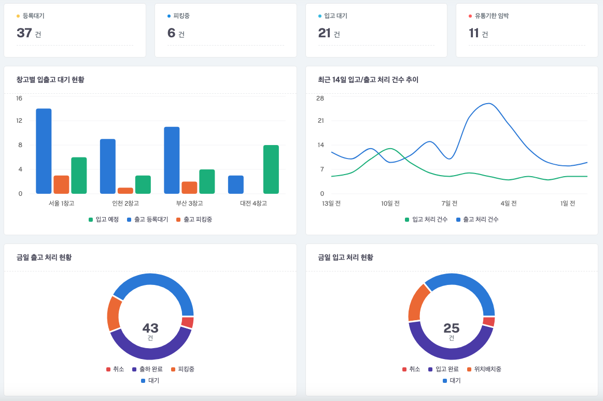
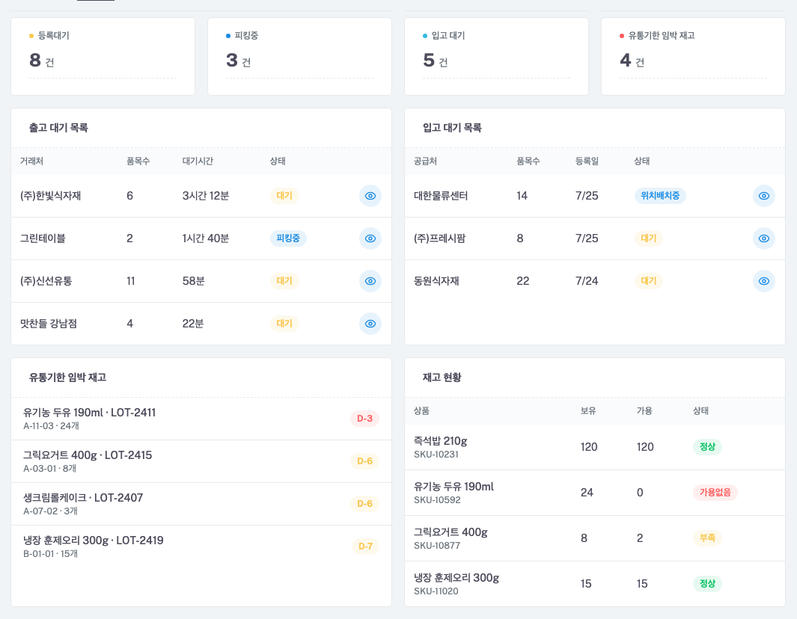
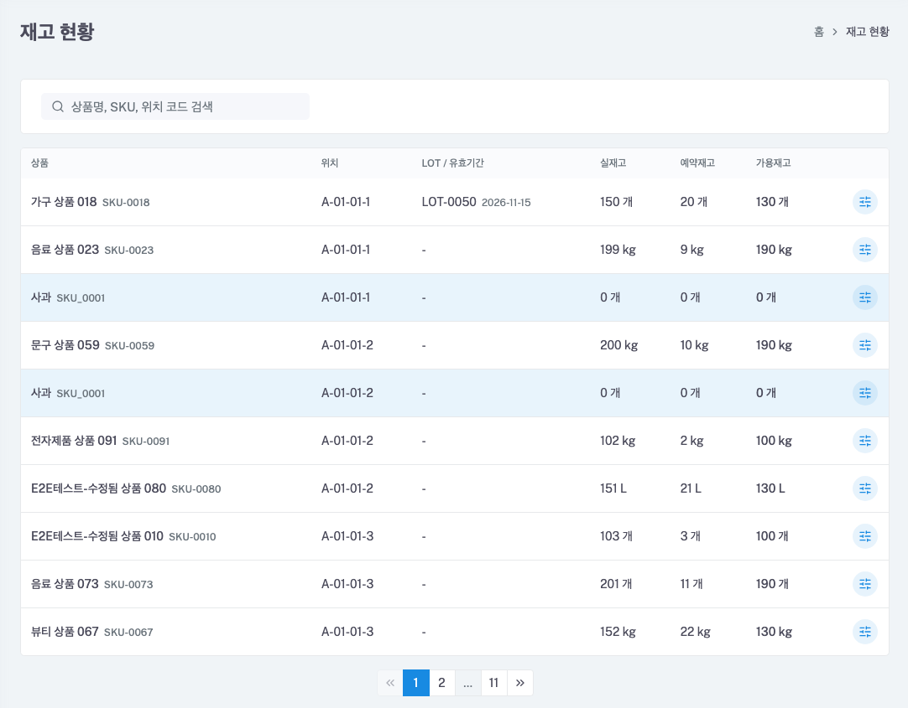
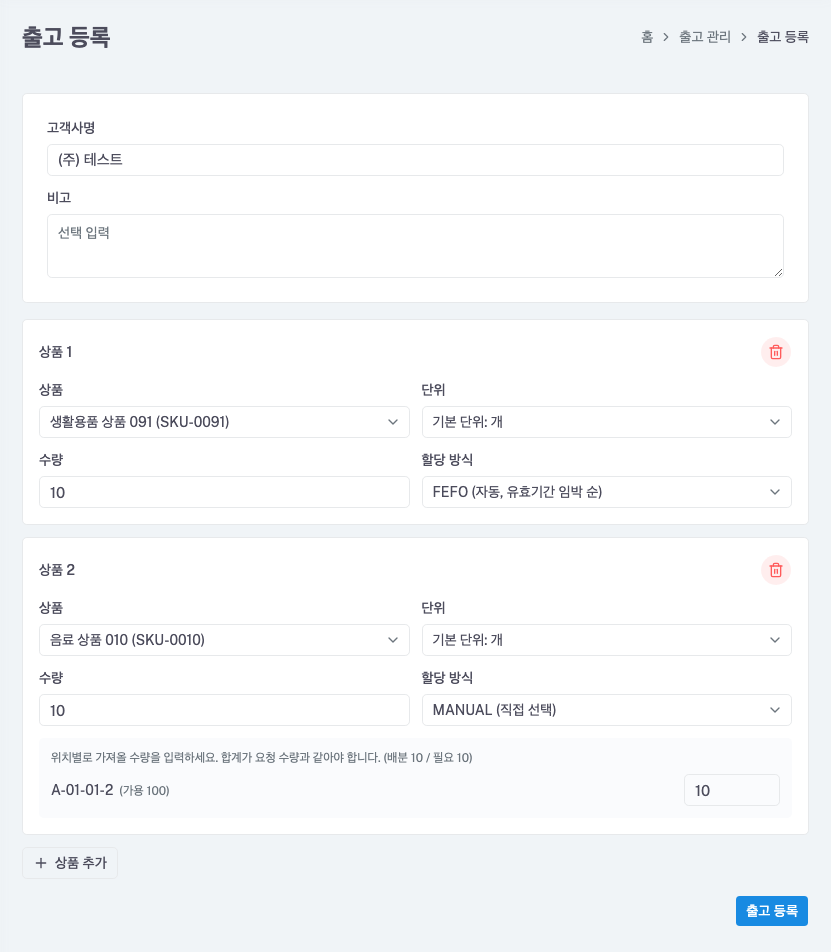

# 모두의 WMS (Warehouse Management System)

**배포 링크**: [https://wms-for-everyone.com](https://wms-for-everyone.com) 

**테스트 계정 정보** (기업관리자)
- 아이디: `company_admin@wms.com`
- 비밀번호: `CompanyAdmin1234!`

## 목차

- [프로젝트 개요](#프로젝트-개요)
- [스크린샷](#스크린샷)
- [기술 스택](#기술-스택)
- [아키텍처](#아키텍처)
- [핵심 도메인](#핵심-도메인)
- [기술적 문제 해결](#기술적-문제-해결)
- [주요 정책 및 권한 체계](#주요-정책-및-권한-체계)
- [문서 목차](#문서-목차)

---

## 프로젝트 개요

| 항목 | 내용                                                           |
|------|--------------------------------------------------------------|
| 프로젝트명 | 모두의 WMS                                                      |
| 목표 | 창고 운영의 전 과정을 통합 관리하는 클라우드 기반 WMS SaaS 플랫폼                    |
| 개발 형태 | 1인 풀스택 개발 (기획 · 설계 · 프론트엔드 · 백엔드 · 인프라/배포)                   |
| 진행 상태 | 1차 개발 및 배포 완료 — EC2에 실제 서비스 운영 중                             |
| 배포 도메인 | [https://wms-for-everyone.com](https://wms-for-everyone.com) |

## 스크린샷

### 대시보드 — 전체 창고 현황

창고별 입출고 대기 현황, 최근 14일 처리 추이, 금일 출고/입고 처리 현황을 한눈에 확인할 수 있습니다.

### 대시보드 — 창고별 상세

특정 창고를 선택하면 출고/입고 대기 목록, 유통기한 임박 재고, 재고 현황을 확인할 수 있습니다.

### 재고 현황

위치·LOT 단위로 실재고 / 예약재고 / 가용재고를 구분해 보여주며, 재고 변동이 발생한 행은 파란색으로 잠시 하이라이트되어 실시간 반영을 확인할 수 있습니다.

### 출고 등록

상품 라인마다 FEFO(자동, 유효기간 임박 순) 또는 MANUAL(직접 위치 선택) 할당 방식을 선택할 수 있습니다.

## 기술 스택

| 영역           | 선택                                                                         |
|--------------|----------------------------------------------------------------------------|
| 백엔드          | Java 21, Spring Boot 3.5                                                   |
| ORM          | Spring Data JPA + QueryDSL                                                 |
| DB           | PostgreSQL                                                                 |
| In-memory DB | Redis (멱등성 키, Refresh Token 등 단기 유효 데이터)                                   |
| 인증           | JWT                                                                        |
| 프론트엔드        | React, TypeScript, Vite, TailwindCSS                                       |
| API 문서       | springdoc-openapi(Swagger)                                                 |
| 테스트          | Testcontainers(PostgreSQL), Mockito                                        |
| 인프라          | Docker Compose, GitHub Actions(CI/CD), AWS EC2, GHCR, Nginx, Let's Encrypt |

## 아키텍처

### 1. DDD 기반 4계층 아키텍처

이 프로젝트는 DDD에서 제시하는 4계층 아키텍처를 기반으로 구성했습니다.

ui계층은 사용자나 외부 시스템의 요청을 받아 애플리케이션 계층으로 전달하고 응답을 반환하는 진입점 역할을 담당합니다. 
업무 도메인은 com.jiubuntu.wms.biz 하위에 도메인별로 분리했습니다. 각 도메인은 하나의 Bounded Context처럼 독립적으로 관리하며, Service와 Validator는 자신의 도메인 Repository만 직접 참조하도록 구성했습니다. 다른 도메인의 데이터가 필요한 경우에는 해당 도메인의 Service를 통해 접근하도록 하여 도메인 간 결합도를 낮췄습니다.

화살표는 계층 간 의존 방향을 나타냅니다.

도메인 간 의존 관계도 한 방향으로만 유지했습니다. 여러 도메인을 함께 사용하는 기능이 필요하면 이를 조합하는 도메인이 다른 도메인의 Service를 호출하는 방식으로 처리하여 순환 참조가 발생하지 않도록 설계했습니다.

### 2. 시스템 아키텍처 (EC2)

애플리케이션은 하나의 EC2 인스턴스에서 docker-compose 기반으로 컨테이너가 구성되어 있습니다. Spring Boot, React, PostgreSQL, Redis 각각 컨테이너로 분리하여 실행하고, Nginx가 외부 요청을 받아 프론트엔드와 백엔드로 라우팅합니다.

- 개인 프로젝트인 만큼 운영 비용을 줄이기 위해서 DB와 Redis는 관리형 서비스(RDS, ElastiCache) 대신 EC2 내부 컨테이너로 구성했습니다.

### 3. CI/CD 흐름

GitHub Actions를 이용해 이미지 빌드부터 배포까지 자동화했습니다.

배포는 main 브랜치에 릴리즈 태그를 Push하면 시작됩니다.
1. GitHub Actions가 Docker 이미지를 빌드
2. 생성된 이미지를 GHCR에 Push
3. EC2에서 최신 이미지를 Pull
4. docker-compose를 통해 서비스를 재시작하여 배포를 완료

## 핵심 도메인

| 도메인 | 설명 |
|--------|------|
| 사용자 | 회원가입 / 로그인 / 인증 |
| 공통 코드 | 카테고리, 보관 유형 등 시스템 코드 관리 |
| 상품 | SKU 기반 상품 관리, 단위 변환, LOT 관리 |
| 창고 | 물리적 창고 관리 |
| 위치 | 창고 내 세부 위치 (구역-행-열-단) |
| 재고 | 위치별 상품 수량 실시간 관리 |
| 입고 | 상품 입고 처리 플로우 |
| 출고 | 상품 출고 처리 플로우 |
| 재고 이동 | 창고 내 위치 간 이동 |
| 재고 이력 | 모든 재고 변동 자동 기록 (append-only) |

## 설계 과정에서 고민한 문제

### 1. 오버셀(초과 판매) 방지 - 실재고 / 예약재고 / 가용재고 분리

**문제** 
1. 출고 등록 시점에는 재고가 충분했지만, 출고를 확정하기 전에 다른 출고가 먼저 처리되면 실제로는 재고가 부족한 상황이 발생할 수 있었습니다.
2. 검증(가용재고 확인)과 예약이 서로 다른 시점에 수행되면 두 요청 모두 재고가 있다고 판단하는 레이스 컨디션이 발생할 수 있었습니다.

**고민 과정** 

처음에는 가용재고를 별도 컬럼으로 관리하는 방법을 고려했습니다.
조회 시 계산이 필요 없다는 장점이 있었지만, 실재고, 예약재고, 가용재고 3개의 값을 항상 함께 정합성을 맞춰주어야 했습니다.
반면 가용재고는 

> 가용재고 = 실재고 - 예약재고

만으로 계산 가능했고, 계산에 드는 비용도 0에 수렴하기 때문에 별도로 저장하지 않아도 충분하다고 판단했습니다.
따라서 계산 비용보다 세 컬럼의 정합성을 유지하는 비용이 더 크다고 판단해 가용재고는 저장하지 않는 방향을 선택했습니다.

**해결 방법** 

1. inventory 테이블에 reserved_quantity를 추가하여 실재고와 예약재고를 분리했습니다.
2. 출고 등록 시 
- 가용재고 확인 
- 예약재고 증가

를 하나의 트랜잭션에서 처리하도록 구성했습니다.

 

### 2. 동시성 제어 - 비관적 락 대신 낙관적 락 단일 채택

**문제**
1. 재고는 여러 액션(입고/출고/재고이동/조정)과 여러 사용자가 동시에 건드릴 수 있는 도메인이기 때문에, 동시성과 정합성 문제가 발생할 수 있는 문제가 있었습니다. 

**고민 과정** 

동시성 제어 방식으로 비관적 락과 낙관적 락을 비교했습니다. 비관적 락은 충돌을 확실히 막을 수 있지만, 경합 여부와 관계없이 항상 DB Row Lock을 사용하여 성능은 좋지 않지만 정합성은 확실히 보장할 수 있다는 특징이 있고, 
반대로 낙관적 락은 비관적 락 보다 정합성은 떨어질 수 있지만 성능이 더 좋아 속도가 빠르다는 특징이 있으며, 실제 충돌이 발생했을 때만 재시도하면 되므로 평상시에는 추가 비용이 없습니다.
이 서비스의 특징을 검토해보았을 때
1. 이 프로젝트는 불특정 다수가 사용하는 플랫폼이 아니다. 
2. 기업에서만 사용하는 창고 작업자가 사용자의 대부분을 차지한다.
3. 동일한 재고를 여러 작업자가 동시에 수정하는 상황이 발생할수는 있지만 자주 발생하지는 않는다. 

위와같은 이유로 서비스 특성 상 충돌 가능성이 낮다고 판단하여 낙관적 락을 적용하였습니다.

**해결 방법**
1. inventory 엔티티에 @Version 을 적용하여 낙관적 락을 적용했습니다.
2. 충돌이 발생했을 때, 재조회 -> 재검증 -> 재시도 패턴으로 처리하도록 구현했습니다.

**선택 이유** 

실제 WMS에서는 이커머스 플랫폼의 주문처럼 동일한 상품에 동시 요청이 집중되는 경우가 드물다고 생각합니다.
경합이 드문 환경에서 항상 락 비용을 지불하는 것보다, 충돌이 발생한 경우에만 재시도하는 방식이 더 적합하다고 판단했습니다.

### 3. 데드락 회피 - 여러 위치를 갱신할 때 정렬 순서 고정

**문제** 

재고 이동은 출발 위치와 도착 위치를 하나의 트랜잭션에서 함께 수정합니다.
이때 트랜잭션마다 Row를 수정하는 순서가 다르면 데드락이 발생할 수 있는 문제가 있었습니다. 예시)
1. A가 위치1 UPDATE 성공 (락 보유, 트랜잭션 안 끝남)
2. B가 위치2 UPDATE 성공 (락 보유, 트랜잭션 안 끝남)
3. A가 위치2 UPDATE 시도 → B가 쥐고 있어서 대기
4. B가 위치1 UPDATE 시도 → A가 쥐고 있어서 대기
5. A는 B의 커밋을, B는 A의 커밋을 기다리는 순환 대기 → 데드락

**고민 과정** 

처음에는 업무 흐름 그대로 출발 위치 → 도착 위치 순으로 수정하도록 구현했습니다. 
하지만 반대 방향의 이동이 동시에 발생하면 서로 다른 순서로 Row Lock을 획득하게 되어 데드락이 발생할 수 있다는 점을 확인했습니다.

**해결 방법** 

업무 순서와 관계없이 항상 location_id가 작은 Row부터 수정하도록 순서를 통일했습니다.

**선택 이유** 

모든 트랜잭션이 동일한 순서로 락을 획득하면 순환 대기가 발생하지 않아 데드락을 예방할 수 있기 때문입니다.

### 4. 멱등성 - 네트워크 재시도/더블클릭으로 인한 중복 처리 방지

**문제**  

창고 작업자가 태블릿/스캐너 등 불안정한 네트워크 환경에서 등록 버튼을 조작하면, 같은 요청이 중복 전송되어 재고가 두 번 반영될 수 있는 여지가 존재했습니다.

**고민 과정** 
단순히 DB Unique 제약으로 중복을 막는 방법도 생각했지만, 요청 자체를 동일한 작업으로 판단하고 이전 응답을 반환하는 기능 구현이 필요했는데 애플리케이션에서 구현했을 때의 비용과 복잡도가 Redis를 사용했을 때보다 높다고 판단했습니다. 
또한 Redis를 사용할 때는 Hash와 String 두 가지 저장 방식도 비교했습니다. 
Hash는 상태와 TTL을 각각 관리해야 해서 원자성이 보장되지 않았고, String은 값과 TTL을 함께 갱신할 수 있어 원자성을 보장할 수 있었습니다.

**해결 방법** 

클라이언트는 요청마다 Idempotency-Key 즉 작업마다 유니크한 값을 생성하여 서버로 전달하도록 구현했습니다. 
서버는 Redis에 요청 상태를 저장하고
- 진행 중
- 완료
- 실패

상태에 따라 요청을 처리하거나 기존 응답을 반환하도록 구현하였고 
Redis 자료구조는 String(JSON)을 사용했습니다.

상태에 따른 요청 처리는 아래와 같습니다.

| 같은 키의 기존 기록 | 상태값 | 처리                     |
|---|---|------------------------|
| 없음 | - | 컨트롤러 실행                |
| 있음 | FAILED | 컨트롤러 실행                |
| 있음 | IN_PROGRESS | Response Code 409      |
| 있음 | COMPLETED | 저장된 응답 그대로 반환 (재처리 없음) |

## 주요 정책 및 권한 체계

### 권한 체계 (4단계 고정 역할)

로그인 계정마다 아래 4개 역할 중 하나를 가지며, 역할에 따라 접근 가능한 화면과 데이터 범위가 다릅니다.

| 역할 | 설명 | 가입 방법                                | 접근 범위 |
|------|------|--------------------------------------|-----------|
| 시스템관리자 | 플랫폼 전체 운영자. 기업 가입 승인/반려를 담당 | 별도 발급 X                              | 전체 기업 데이터 |
| 기업관리자 | 한 기업의 관리자. 창고 생성, 직원(창고관리자/작업자) 계정 발급 및 창고 배정을 담당 | 자유 가입 후 시스템관리자 승인으로 활성화              | 소속 기업의 모든 창고 |
| 창고관리자 | 배정된 창고의 운영 책임자 | 자유 가입 불가, 기업관리자가 계정 발급 + 창고 배정       | 배정된 창고 1곳 |
| 작업자 | 배정된 창고에서 입출고를 실제로 처리하는 실무자 | 자유 가입 불가, 기업관리자/창고관리자가 계정 발급 + 창고 배정 | 배정된 창고 1곳 |

